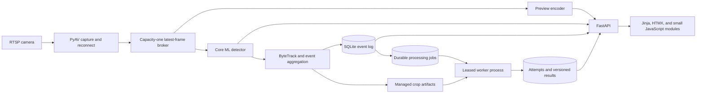
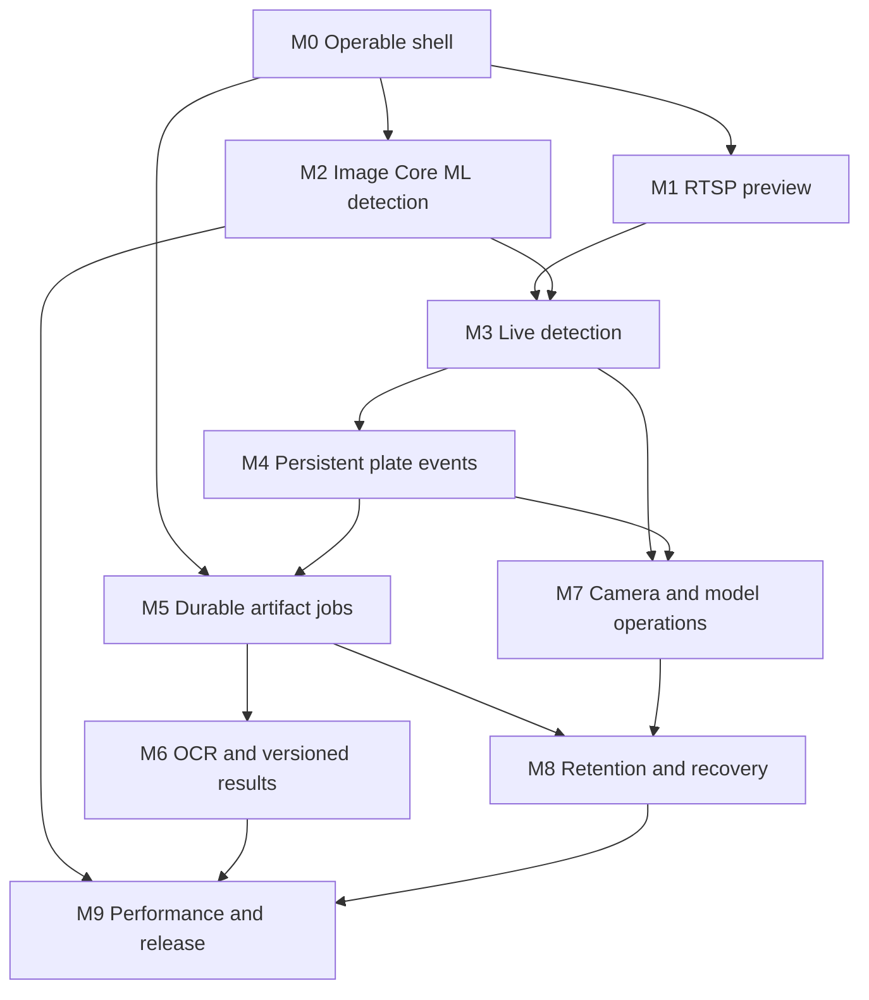

# open-licenseplate - Product and Engineering Specification

Status: proposed implementation specification

Implementation state: documentation only; this specification does not itself authorize or include application code

Document date: 2026-08-29

Project name: `open-licenseplate`

Initial target: Apple Silicon Mac with 24 GB unified memory

Initial operating mode: local, single-user, one active RTSP camera

Initial detector: configurable Core ML license-plate detector, starting with the MorseTechLab YOLO11 nano license-plate model converted to Core ML

## 1. Executive Summary

Build a local application that connects to a network camera over RTSP, detects license plates with a Core ML model, groups repeated frame detections into durable plate events, preserves the best plate crops, and processes completed events asynchronously. The initial asynchronous processor recognizes plate text and stores a versioned result. All important state survives application and worker restarts, and failed work can be inspected, retried, or reprocessed from the browser UI.

The product is Mac-first and Core ML-first, but the architecture must keep camera input, inference, tracking, processing, persistence, and presentation behind explicit contracts. This permits a later ONNX backend and broader platform support without forcing the initial release to carry those costs.

Development is organized into vertical slices. Each milestone produces a user-visible workflow that a human can run and judge. A milestone is not complete because a database layer, UI layer, or service layer exists in isolation. It is complete only when a person can execute the milestone's demo script and observe the expected outcome.

## 2. Product Outcome

The first useful release allows a user to:

1. Start the application locally and open a browser dashboard.
2. Configure an RTSP camera without exposing its password in logs or the database.
3. View the live camera feed and connection health.
4. Register and validate a Core ML license-plate model.
5. Run live plate detection with visible boxes and performance measurements.
6. See one persistent event for each tracked plate appearance rather than one row per frame.
7. Inspect the best crops, confidence, timestamps, camera, and model provenance for an event.
8. Allow a separate durable worker to prepare event artifacts and recognize plate text.
9. Inspect every processing attempt, including failures and error details.
10. Retry the same failed job or reprocess an event with a new model or configuration without destroying prior history.
11. Restart the web service or worker without losing committed events or queued work.
12. Configure local retention and remove old sensitive artifacts predictably.

## 3. Product Principles

### 3.1 Local-first

- Camera frames, plate crops, OCR results, and history remain on the user's Mac by default.
- The application includes no telemetry, analytics, cloud inference, or automatic uploads.
- The web server binds to `127.0.0.1` by default.
- Remote browser access is out of scope until authentication and transport security are designed explicitly.

### 3.2 Durable before convenient

- SQLite is the source of truth for events and processing jobs.
- In-memory queues may coordinate live frame flow, but they may not represent durable work.
- Creating a closed event and its initial job must be one database transaction.
- A process crash after commit may delay work, but it must not erase it.

### 3.3 Current frames over complete frames

- Live capture uses a capacity-one latest-frame broker.
- When inference is slower than capture, an older unprocessed frame is replaced by the newest frame.
- The system reports replaced frames and frame age.
- The live path never builds an unbounded queue of decoded images.

### 3.4 Events over frame detections

- A plate visible in 40 consecutive frames is normally one plate event, not 40 event rows.
- Tracking and event aggregation are separate from model-specific inference details.
- Event evidence stores only a small ranked set of crops by default.

### 3.5 Immutable history

- Processing attempts are append-only.
- Results are versioned and are not overwritten by reprocessing.
- A retry repeats the same job input and configuration.
- A reprocess request creates a new logical job with a new immutable configuration snapshot.

### 3.6 Explicit hardware language

- Core ML compute-unit settings describe which devices Core ML may use.
- `CPU_AND_NE` does not prove that every operation ran on the Apple Neural Engine.
- The UI must not claim ANE-only execution unless Apple exposes and the application collects direct evidence.

### 3.7 Vertical delivery

- Every milestone includes UI, behavior, persistence where needed, error handling, and tests for one user outcome.
- No milestone is named only after a horizontal layer such as "database," "frontend," or "API."
- Each milestone includes a human validation script and evidence to record.

## 4. Scope

### 4.1 In scope for v1

- Apple Silicon macOS runtime.
- One active RTSP camera at a time.
- Multiple saved camera configurations.
- H.264 or H.265 RTSP streams decodable by the installed FFmpeg/PyAV stack.
- Local browser UI served by FastAPI.
- Direct Core ML inference through `coremltools.models.MLModel.predict()`.
- One initial license-plate detection model plus a manifest-driven model registry.
- Model compute-unit selection.
- Live detection overlay and performance metrics.
- ByteTrack-based plate tracking.
- Persistent plate events and best-crop artifacts.
- SQLite-backed durable jobs with leases, attempts, retries, dependencies, and versioned results.
- An initial plate OCR processor using Apple Vision through PyObjC, subject to implementation validation.
- Manual retry, bulk retry, cancellation of eligible jobs, and event reprocessing.
- Configurable data retention and artifact cleanup.
- Recorded-video and fake backends for deterministic development and tests.
- Source execution with documented commands.

### 4.2 Explicit non-goals for v1

- Windows or Linux production runtime.
- ONNX Runtime production inference.
- Multiple simultaneously active cameras.
- Ring camera integration through unofficial APIs.
- Battery-camera event scraping.
- Camera audio playback, recording, or analysis.
- Video recording or continuous archive storage.
- Vehicle make/model classification.
- Face detection or recognition.
- Alerts, watchlists, law-enforcement integrations, or cloud synchronization.
- A public multi-user server.
- A mobile application.
- Training or annotation inside the application.
- Guaranteed recognition of every plate.
- A signed, notarized Mac application bundle for the first implementation.
- Proof that a model executes exclusively on the Neural Engine.

### 4.3 Later possibilities that must not distort v1

- ONNX Runtime backend for Windows and Linux.
- Multiple concurrent camera pipelines.
- WebRTC preview.
- ONVIF discovery and PTZ control.
- Active-learning export and model fine-tuning workflows.
- Cross-event vehicle association.
- User accounts and remote access.

## 5. User Roles and Primary Scenarios

V1 has one role: the local operator.

### 5.1 Configure a camera

The operator provides a name, RTSP URL, optional transport and stream settings, and credentials. The application tests the connection, reports the negotiated resolution and frame rate, saves non-secret configuration in SQLite, and stores the secret in macOS Keychain or accepts it from an environment variable.

### 5.2 Validate a model

The operator imports a `.mlpackage` and a model manifest. The application copies it into managed storage, computes its checksum, inspects its Core ML inputs and outputs, runs a validation prediction, and reports whether its declared adapter is compatible.

### 5.3 Watch live detections

The operator starts the selected camera and model. The Live page shows the preview, detection boxes, model and camera status, current inference latency, processed FPS, frame age, and replaced-frame count.

### 5.4 Review plate events

After a plate leaves the scene, the operator sees one event with first-seen and last-seen timestamps, observation count, maximum confidence, best crops, model provenance, and processing status.

### 5.5 Inspect and recover processing

The operator opens a job, sees every attempt, diagnoses the last error, retries the immutable job, or reprocesses the event with a newer OCR configuration. Prior attempts and results remain available.

### 5.6 Control retention

The operator chooses how long to keep event metadata, plate crops, and OCR results, previews the effect of cleanup, and starts cleanup. Deletion must be narrowly scoped and auditable.

## 6. Terminology

- **Frame:** One decoded image from a camera or recorded source.
- **Detection:** A model output for one plate-shaped region in one frame.
- **Track:** A temporary identity that associates detections across nearby frames.
- **Event:** The durable record of one confirmed track from first seen through closure.
- **Observation:** A single detection associated with a track. Most observations are not stored as rows in v1.
- **Candidate crop:** A plate image retained because it may be useful for recognition.
- **Artifact:** A managed file associated with an event, job, attempt, or result.
- **Job:** Durable processing work with immutable input and configuration snapshots.
- **Attempt:** One worker execution of a job.
- **Retry:** Another attempt of the same logical job and snapshots.
- **Reprocess:** A new job created from an existing event with a new processor, model, or configuration.
- **Lease:** A time-limited ownership claim that permits a worker to execute a job.
- **Backend:** The runtime that executes a model, initially Core ML.
- **Adapter:** Model-family-specific preprocessing and output decoding.
- **Capture session:** One continuous period during which a camera pipeline is running.

## 7. System Architecture



### 7.1 Runtime processes

V1 uses two long-running Python processes:

1. `open-licenseplate serve`
   - FastAPI and browser UI.
   - Camera lifecycle.
   - RTSP capture and reconnect.
   - Preview encoding.
   - Core ML inference.
   - Tracking and event closure.
   - Event and initial-job commits.

2. `open-licenseplate worker`
   - Durable job claim.
   - Lease heartbeat.
   - Artifact preparation.
   - OCR and later processors.
   - Attempt and result recording.

A development convenience command may supervise both processes, but the two responsibilities must remain independently startable and independently crashable.

### 7.2 Why the live pipeline is not a durable queue

Raw frames are high-volume and short-lived. Persisting or queuing every frame would increase latency, memory, and storage without improving the main outcome. Durability begins when a track becomes an event and evidence has been selected. The live frame broker is intentionally lossy; the event and job stores are intentionally durable.

### 7.3 Replaceable contracts

The following contracts must be expressed as typed Python protocols or abstract base classes:

- `FrameSource`
- `InferenceBackend`
- `DetectionAdapter`
- `Tracker`
- `EventAggregator`
- `ArtifactStore`
- `JobRepository`
- `Processor`
- `Clock`

Implementations may be Mac-specific, but domain values passed between contracts must not import Core ML, PyAV, FastAPI, or SQLAlchemy types.

### 7.4 Execution contexts and shutdown

The `serve` process uses explicit ownership rather than allowing arbitrary request handlers to operate camera or model objects:

- The ASGI event loop owns HTTP and WebSocket connections only.
- One capture thread owns the open PyAV container and decode loop.
- One inference worker owns the loaded Core ML model instance and prediction calls.
- A preview encoder reads the latest frame at its own bounded rate.
- A pipeline coordinator accepts start, stop, and settings commands and publishes immutable status snapshots.
- Database repositories open short-lived SQLAlchemy sessions at service boundaries.

Blocking decode, JPEG encoding, Core ML prediction, and SQLite write contention must not block the ASGI event loop.

Graceful shutdown order:

1. Reject new pipeline-start requests.
2. Close live WebSocket and preview subscriptions with a shutdown state.
3. Signal capture to stop and close the PyAV container.
4. Stop inference after its current bounded prediction.
5. Close the loaded model and release frame references.
6. Mark the capture session with its end reason.
7. Allow in-flight database transactions to finish.
8. Stop Uvicorn.

Shutdown has a bounded timeout and records any component that does not stop cleanly.

## 8. Technology Stack

### 8.1 Application and API

- Python 3.12 initially, subject to the supported range of the selected Core ML and PyObjC releases.
- FastAPI for HTTP routing, validation, and API documentation.
- Uvicorn as the local ASGI server.
- Pydantic v2 and `pydantic-settings` for request schemas and configuration.
- `uv` for dependency resolution, commands, and lockfile management.

### 8.2 Persistence

- SQLite in WAL mode.
- SQLAlchemy 2.0 using synchronous sessions.
- Alembic migrations.
- Explicit repository classes around transactional behavior.
- Carefully reviewed SQL through SQLAlchemy for atomic job claim and other concurrency-sensitive operations.

Required connection pragmas:

```sql
PRAGMA journal_mode = WAL;
PRAGMA synchronous = FULL;
PRAGMA foreign_keys = ON;
PRAGMA busy_timeout = 5000;
```

### 8.3 Camera and images

- PyAV and its FFmpeg bindings for RTSP decode, media timestamps, and reconnect behavior.
- OpenCV for image quality measurements, drawing helpers, resize, and encoding where appropriate.
- NumPy for image arrays and model input preparation.
- Pillow only where a Core ML image input or image metadata path benefits from it.

### 8.4 Inference and tracking

- `coremltools` for direct `.mlpackage` loading and prediction.
- Ultralytics and PyTorch only in optional model conversion tooling, never in the live runtime path.
- `supervision` ByteTrack for the first tracker implementation.
- A manifest-described detection adapter for the converted YOLO11 model.

### 8.5 Processing

- A custom SQLite-backed worker loop rather than Celery, RQ, FastAPI background tasks, or an in-memory queue.
- Apple Vision text recognition through PyObjC as the preferred initial OCR processor.
- Processor interfaces that permit a later ONNX OCR implementation.

### 8.6 UI

- Jinja2 templates for page structure.
- HTMX for forms, filtered lists, status fragments, and retry actions.
- Small JavaScript or TypeScript modules for synchronized live preview, WebSocket messages, overlays, and performance charts.
- Regular CSS with a small application-specific design system. Tailwind may be used only if the implementation team decides the build dependency is justified.
- No React requirement for v1.

### 8.7 Tests and quality

- Pytest.
- Ruff for formatting and linting.
- Mypy or Pyright for the typed domain and service contracts.
- Playwright for browser acceptance checks if it can be kept reliable.
- Recorded fixtures and fake inference for platform-independent tests.
- Mac-only integration markers for Core ML, Keychain, camera, and Apple Vision.

## 9. Repository Shape

This is a proposed structure, not a requirement to create empty modules in advance:

```text
open-licenseplate/
|-- pyproject.toml
|-- uv.lock
|-- README.md
|-- SPEC.md
|-- alembic.ini
|-- migrations/
|-- model-manifests/
|-- src/open_licenseplate/
|   |-- cli.py
|   |-- app.py
|   |-- domain/
|   |-- config/
|   |-- cameras/
|   |-- inference/
|   |-- tracking/
|   |-- events/
|   |-- processing/
|   |-- storage/
|   |-- api/
|   `-- web/
`-- tests/
    |-- unit/
    |-- integration/
    |-- acceptance/
    |-- fixtures/
    `-- macos/
```

Code should appear when a vertical slice needs it. Do not scaffold every future directory with placeholder code during the first milestone.

## 10. Domain Contracts

### 10.1 Frame source

```python
class FrameSource(Protocol):
    def open(self) -> SourceInfo: ...
    def read(self) -> VideoFrame | None: ...
    def close(self) -> None: ...
```

`VideoFrame` contains:

- Monotonic sequence number.
- BGR or RGB pixel data with an explicit format.
- Host UTC receipt time.
- Host monotonic receipt time.
- Camera or media presentation timestamp when available.
- Source dimensions.
- Capture-session identifier.

Host UTC, host monotonic time, and camera PTS must remain distinct. They answer different questions and may drift independently.

### 10.2 Detection backend

```python
class InferenceBackend(Protocol):
    def load(self, model: ModelDescriptor, options: BackendOptions) -> LoadedModel: ...
    def predict(self, model: LoadedModel, model_input: object) -> BackendOutput: ...
    def close(self, model: LoadedModel) -> None: ...
```

The Core ML backend owns model loading and prediction. It does not know license-plate event semantics.

### 10.3 Detection adapter

```python
class DetectionAdapter(Protocol):
    def preprocess(self, frame: VideoFrame, manifest: ModelManifest) -> PreparedInput: ...
    def decode(self, output: BackendOutput, transform: ImageTransform) -> DetectionBatch: ...
```

The adapter owns:

- Color conversion.
- Resize or letterbox.
- Scaling and normalization not embedded in the model.
- Output-name mapping.
- Confidence filtering.
- NMS only if it is not embedded in the model.
- Mapping boxes back to source-image pixel coordinates.

### 10.4 Unified detection

A `Detection` contains:

- Source-pixel `box_xyxy`.
- Class identifier.
- Label.
- Confidence from 0 through 1.
- Frame sequence.
- Detection timestamp.
- Model identifier and checksum.

Coordinates are clipped to image bounds. Boxes with non-finite values or non-positive area are rejected.

### 10.5 Processor

```python
class Processor(Protocol):
    @property
    def job_type(self) -> str: ...

    @property
    def version(self) -> str: ...

    def process(self, context: ProcessingContext) -> ProcessingOutput: ...
```

A processor receives only the immutable job snapshot, read-only event data, resolved artifacts, and a narrowly scoped output directory. It must not read current global settings to reinterpret an old job.

## 11. Configuration and Secrets

### 11.1 Configuration precedence

Use this precedence, highest first:

1. Explicit command-line option.
2. Environment variable.
3. Persisted application setting.
4. Built-in default.

Every effective setting shown in diagnostics should include its source without displaying secret values.

### 11.2 Camera credentials

- Preferred: store username and password in macOS Keychain through `keyring`.
- Alternative for automated development: environment variables referenced by name.
- SQLite stores only a credential reference.
- Logs, errors, tracebacks, API responses, and browser markup must redact user info embedded in RTSP URLs.
- The UI never returns a stored password after save.

### 11.3 Managed paths

Use `platformdirs` to resolve locations. Expected macOS layout:

```text
~/Library/Application Support/open-licenseplate/
    open-licenseplate.sqlite3
    models/
    artifacts/
    staging/
    settings.json

~/Library/Logs/open-licenseplate/
    app.log
    worker.log
```

No cleanup operation may recursively target the application-support root. Cleanup must resolve and validate individual managed artifact paths.

## 12. Core ML Model Management

### 12.1 Initial detector

The approved catalog source lock is:

- Repository: `morsetechlab/yolov11-license-plate-detection`
- Revision: `251a30d7daedca065f56e04b0af04052c907c68f`
- Weights: `license-plate-finetune-v1n.pt`, `license-plate-finetune-v1s.pt`, and
  `license-plate-finetune-v1m.pt`
- Training input: 640 by 640
- Intended class: license plate
- License shown by the repository: AGPL-3.0

The model documentation warns that source dataset splits may be contaminated
and reported metrics may be inflated. The application must not present
upstream metrics as proof of performance for the user's camera.

The model is converted outside the live runtime, then imported as a managed
`.mlpackage`. The exact source file, source checksum, Ultralytics and
`coremltools` versions, conversion arguments, inspected Core ML contract,
package tree checksum, archive checksum, and release asset name are recorded in
the generated catalog manifests. The committed lock file contains fixed HTTPS
release asset URLs and verified checksums.

The reproducible catalog build uses:

```bash
BUILD_ROOT="$(mktemp -d /tmp/open-licenseplate-model-catalog.XXXXXX)"
uv venv --python 3.12.14 "$BUILD_ROOT/.venv"
uv pip sync \
  --python "$BUILD_ROOT/.venv/bin/python" \
  --python-version 3.12.14 \
  --python-platform aarch64-apple-darwin \
  --only-binary :all: \
  --require-hashes \
  tools/model_catalog/requirements-macos-arm64.lock
"$BUILD_ROOT/.venv/bin/python" \
  tools/model_catalog/build.py \
  --output-dir "$BUILD_ROOT/output"
```

The build script downloads only the three listed weights at the pinned
revision. It exports Core ML with NMS enabled, inspects the actual package,
normalizes volatile package metadata, creates reproducible archives, and
writes the catalog metadata. Automatic download from these pinned assets is an
approved later extension; custom local model import remains a required
fallback.

### 12.2 Model manifest

Each managed model has a versioned manifest similar to:

```yaml
schema_version: 1
id: morsetech-yolo11n-plate-coreml-640
display_name: MorseTech YOLO11n Plate Detector
task: object_detection
backend: coreml
adapter: ultralytics_yolo_nms
artifact: model.mlpackage
artifact_sha256: "..."
input:
  name: image
  kind: image
  width: 640
  height: 640
  color_space: rgb
preprocessing:
  resize: letterbox
outputs:
  boxes: coordinates
  scores: confidence
  box_format: xyxy
  coordinate_space: model_pixels
labels:
  - license_plate
defaults:
  confidence_threshold: 0.35
  iou_threshold: 0.45
compatibility:
  minimum_macos: "implementation-validated value"
source:
  url: https://huggingface.co/morsetechlab/yolov11-license-plate-detection
  license: AGPL-3.0
conversion:
  source_weight: license-plate-finetune-v1n.pt
  tool_versions: {}
  arguments: {}
```

Output names and adapter configuration must reflect the actual converted artifact. They may not be guessed from the model family. The manifest must also declare `outputs.box_format` (`xyxy` or `xywh`) and `outputs.coordinate_space` (`model_pixels` or `normalized`). A manifest with `outputs.raw` must declare `outputs.raw_layout` as `candidates_first` (`[N,A]`), `channels_first` (`[1,A,N]`), or `channels_last` (`[1,N,A]`), plus the boolean `outputs.raw_has_objectness`. The adapter must reject undeclared matrix orientation and convert normalized coordinates to model pixels before inverse letterbox mapping.

### 12.3 Model import validation

The browser import accepts a manifest plus a ZIP archive containing one `.mlpackage`; extraction rejects absolute paths, parent traversal, symlinks, unexpected executable content, and size-limit violations. A local CLI may import a `.mlpackage` directory directly because browsers do not portably upload directory packages.

Import performs these steps:

1. Copy into a unique staging directory.
2. Validate manifest syntax and schema.
3. Compute and compare checksums.
4. Inspect Core ML input and output descriptions.
5. Confirm the declared adapter exists.
6. Load with the selected compute configuration.
7. Run a synthetic or bundled validation image.
8. Validate decoded detection shape and numeric bounds.
9. Record validation metadata.
10. Atomically rename staging into the managed model directory.

The importer never executes Python or shell code from the imported directory.

### 12.4 Compute configurations

Expose:

```text
All                   -> ct.ComputeUnit.ALL
CPU only              -> ct.ComputeUnit.CPU_ONLY
CPU and GPU           -> ct.ComputeUnit.CPU_AND_GPU
CPU and Neural Engine -> ct.ComputeUnit.CPU_AND_NE
```

Compute units are selected at model load time. Switching requires a new model instance and initially requires stopping the active pipeline.

## 13. Camera and Live-Frame Behavior

### 13.1 RTSP connection

- Default to RTSP over TCP for reliability.
- Permit UDP as an advanced option.
- Apply bounded open and read timeouts.
- Select the configured video stream and ignore audio in v1.
- Report actual codec, resolution, nominal frame rate, and camera PTS availability.
- Do not block the FastAPI event loop on decode or reconnect.

### 13.2 Reconnect state machine

```text
stopped -> connecting -> streaming
                     -> degraded -> reconnecting -> streaming
                     -> failed
streaming -> stopping -> stopped
```

- Initial connection failure reports an actionable error.
- After a successful session, transient disconnects retry with exponential backoff and jitter.
- Backoff has a configurable ceiling.
- A user-initiated stop cancels reconnect immediately.
- Reconnect starts a new capture session if timestamp continuity cannot be trusted.

### 13.3 Latest-frame broker

- Capacity is one frame.
- A write replaces an unread frame atomically.
- Capture never waits for inference.
- Metrics include captured frames, consumed frames, replaced frames, decode errors, reconnect count, and newest-frame age.
- On stop, all array references are released promptly.

### 13.4 Browser preview

M1 uses MJPEG generated from the latest decoded frame for camera setup. It is simple, local, and inspectable.

M3 adds a synchronized detection-preview WebSocket. Each display unit contains metadata followed by the JPEG bytes for the exact processed frame. The browser renders that image and draws its detections on a canvas. This avoids pairing boxes from one frame with an unrelated newer MJPEG frame.

The raw MJPEG encoder and processed-preview encoder have independent bounded rates. A slow browser receives newer display units instead of an accumulating queue. WebRTC is a future replacement if latency or bandwidth becomes unacceptable.

## 14. Tracking and Event Aggregation

### 14.1 Track lifecycle

```text
candidate -> confirmed -> active -> closed
       |          |
       +-> expired+-> expired before persistence
```

Initial defaults:

- Confirm after 3 matched observations within a short window.
- Close after approximately 1 second without a match.
- Treat defaults as configurable and camera-specific.
- Persist only confirmed tracks as events.

ByteTrack identifiers are unique only within a capture session. Durable identity is `(capture_session_id, track_id)`.

### 14.2 Crop ranking

Retain the best 2 or 3 candidate crops per event. Ranking considers:

- Detection confidence.
- Plate pixel width and height.
- Sharpness.
- Exposure and contrast.
- Saturation or clipping.
- Distance from image boundaries.
- Optional perspective penalty.

The exact scoring formula must be versioned because it influences downstream OCR.

### 14.3 Event closure transaction

When an event closes, one transaction must:

1. Update final event timestamps and summary values.
2. Record committed artifact metadata for selected crops.
3. Create the initial `prepare_event_artifacts` job with an idempotency key.
4. Commit all rows together.

Artifacts are written through staging and atomic rename before committed metadata references their final path. If file commit and database commit cannot be perfectly atomic together, startup reconciliation must safely identify and repair or quarantine the narrow failure cases.

## 15. Persistence Model

All primary identifiers are UUIDs stored in a consistent representation. All wall-clock timestamps are UTC ISO values or UTC-aware database timestamps. Monotonic times never survive process restarts and are stored only where meaningful within a capture session.

### 15.1 `cameras`

Required fields:

- `id`
- `name`
- Redacted endpoint description
- Credential reference
- RTSP transport and connection options JSON
- Preferred stream/profile
- Optional region of interest
- Enabled flag
- Created and updated timestamps

### 15.2 `models`

Required fields:

- `id`
- Display name
- Backend
- Adapter
- Managed artifact path
- Artifact SHA-256
- Manifest JSON snapshot
- Validation state and details
- Source and license metadata
- Created and last-validated timestamps

### 15.3 `capture_sessions`

Required fields:

- `id`
- Camera ID
- Model ID and checksum
- Compute configuration
- Start and end UTC timestamps
- End reason
- Negotiated codec, dimensions, and FPS
- Application version

### 15.4 `detection_events`

Required fields:

- `id`
- Camera ID
- Capture-session ID
- Track ID
- Model ID and model checksum
- First-seen and last-seen UTC timestamps
- Duration
- Observation count
- Maximum confidence
- Event state
- Best-artifact ID when available
- Crop-ranking version
- Created and updated timestamps

Uniqueness constraint:

```text
(capture_session_id, track_id)
```

### 15.5 `event_artifacts`

Required fields:

- `id`
- Event ID
- Artifact kind
- Managed relative path
- SHA-256
- MIME type
- Byte size
- Width and height
- Source frame sequence and timestamp
- Detection confidence
- Quality score and scoring version
- Created timestamp
- Deletion timestamp when removed by retention

### 15.6 `processing_jobs`

Required fields:

- `id`
- Optional event ID
- Job type
- State
- Priority
- Idempotency key
- Processor name and version
- Immutable input snapshot JSON
- Immutable configuration snapshot JSON
- Available-at timestamp
- Lease owner, lease expiry, and heartbeat timestamp
- Attempt count and maximum attempts
- Last error category and summary
- Created, updated, started, and finished timestamps

Job states:

```text
pending
running
succeeded
failed
dead
cancelled
blocked
```

### 15.7 `processing_attempts`

Required fields:

- `id`
- Job ID
- Attempt number, unique within job
- Worker ID
- Start and finish timestamps
- Outcome
- Error category, message, and safe diagnostic details
- Retry decision and next available timestamp
- Processor version
- Runtime metrics JSON

Attempts are never overwritten.

### 15.8 `processing_results`

Required fields:

- `id`
- Job ID
- Event ID
- Logical result type
- Result version
- Processor name and version
- Model or framework provenance
- Result payload JSON
- Optional normalized search text and numeric confidence for indexable result types
- Primary-result flag
- Created timestamp
- Optional retention-redacted timestamp and reason

Results are append-only during normal processing. Changing which result is primary is a separate auditable update and does not delete older results. An explicit retention operation may redact sensitive payload and search text while preserving a minimal tombstone showing that a result existed and why it was removed.

### 15.9 `processing_job_dependencies`

Fields:

- Job ID
- Depends-on job ID
- Created timestamp

The pair is unique. A job is eligible only when every required predecessor succeeded. A failed or dead predecessor blocks its dependents with a visible reason.

### 15.10 Recommended indexes

- Events by camera and first-seen descending.
- Events by processing summary and first-seen.
- Jobs by state, available-at, and priority.
- Jobs by event ID.
- Running jobs by lease expiry.
- Attempts by job and attempt number.
- Results by event, result type, and created timestamp.
- Results by normalized search text when populated.
- Artifacts by event and kind.

Use a partial uniqueness rule so at most one result of a logical type is marked primary for an event. The database also enforces unique job idempotency keys and unique managed artifact paths.

### 15.11 `application_settings`

Required fields:

- Setting key
- JSON value
- Schema version
- Updated timestamp

Only non-secret settings are stored here. Settings with operational history or relational meaning belong in their domain table rather than this generic table.

### 15.12 `worker_instances`

Required fields:

- Worker ID
- Process start timestamp
- Last heartbeat timestamp
- Application version
- Host identifier and process ID for local diagnostics
- Advertised processor types and versions
- Graceful-stop timestamp when available

Worker rows support the System page and do not replace per-job leases. A stale worker heartbeat never keeps a job leased past the job's own lease expiry.

## 16. Durable Processing Semantics

### 16.1 Job creation

An initial event job uses an idempotency key such as:

```text
event:{event_id}:prepare:{processor_version}:{config_hash}
```

An OCR job may use:

```text
event:{event_id}:ocr:{processor_version}:{model_hash}:{config_hash}
```

A unique constraint prevents duplicate logical jobs during repeated callbacks or restart reconciliation.

### 16.2 Atomic claim

The worker must claim one eligible job in a short transaction:

1. Begin an immediate write transaction.
2. Select one pending or retryable job whose `available_at` has passed and whose dependencies succeeded, or one running job whose lease expired.
3. Update it to `running`, assign worker and lease, increment attempt count, and create an attempt row.
4. Commit.
5. Perform work outside the transaction.

SQLite permits one writer at a time, so transactions must remain short.

### 16.3 Heartbeat and recovery

- The worker renews the lease before half its duration has elapsed.
- Heartbeat execution is independent of the processor call so a long model invocation does not prevent renewal.
- If a worker exits, the lease eventually expires.
- Another worker may reclaim the job and starts a new attempt.
- A late worker may not commit after losing its lease; result commit checks current ownership.
- Processor outputs are idempotent or staged under attempt-specific paths.

### 16.4 Failure classes

- **Transient:** temporary file lock, temporary decode failure, resource pressure, or another condition likely to succeed later.
- **Permanent:** missing immutable input, unsupported image, incompatible processor configuration, or invalid model.
- **Operator action:** cancelled job or deliberately disabled processor.
- **Unknown:** initially retryable up to the configured limit, then dead.

Transient retry uses exponential backoff with jitter. Permanent failure becomes `dead` without exhausting meaningless retries.

### 16.5 Retry and reprocess

**Retry:**

- Same job ID.
- Same input and configuration snapshots.
- New attempt row.
- Allowed for failed or dead jobs after validation.
- Does not erase previous errors.

**Reprocess:**

- New job ID and idempotency key.
- New configuration, model, or processor snapshot.
- Prior jobs and results remain visible.
- May designate a new result as primary only after success.

### 16.6 Initial dependency chain

```text
prepare_event_artifacts -> recognize_plate
```

Preparation produces canonical crops, thumbnails, checksums, and quality metadata. Recognition reads those committed artifacts and produces raw OCR candidates plus a chosen candidate when confidence rules permit.

### 16.7 Retention interaction

- Pending, running, failed, and blocked jobs pin every artifact required by their immutable input snapshot.
- Retention may not remove a pinned input.
- Crop expiration records an artifact tombstone so event pages distinguish intentional removal from corruption.
- OCR-result expiration redacts payload and indexed search text but preserves result provenance and the retention reason.
- Full event-metadata deletion is permitted only when all related jobs are terminal and the retention preview identifies the complete aggregate that will be removed.
- A retry is rejected if an operator has explicitly removed a required input after the job became terminal. The UI explains that a new source artifact would be required.

## 17. OCR Behavior

### 17.1 Initial processor

The preferred first implementation uses Apple Vision text recognition through PyObjC. During its milestone, a technical spike must confirm API stability, orientation handling, concurrency behavior, and distributable dependencies. If it fails the spike, an ONNX-based OCR processor may replace it through the same `Processor` contract, with the decision recorded.

### 17.2 Multi-crop recognition

The processor runs recognition over each retained crop and stores:

- Raw candidate string.
- Normalized candidate string.
- Confidence.
- Source artifact ID.
- Character alternatives when the framework exposes them.
- Processor and framework version.

Consensus may select a primary reading when multiple crops agree. The system must preserve raw outputs and must not silently transform ambiguous characters to match an expected plate format.

### 17.3 Result states

- Recognized with adequate confidence.
- Ambiguous, with candidates.
- No text found.
- Processor failed.

No-text-found is a successful processor outcome, not an infrastructure failure.

## 18. API Specification

Use `/api/v1` for JSON and streaming endpoints. HTML page routes may remain unversioned.

### 18.1 Health and system

```text
GET  /api/v1/health/live
GET  /api/v1/health/ready
GET  /api/v1/system/status
GET  /api/v1/system/metrics
```

Liveness means the HTTP process can respond. Readiness means migrations are current, managed directories are writable, and required runtime configuration is valid. A camera or model being stopped does not make the web service unready.

### 18.2 Cameras

```text
GET    /api/v1/cameras
POST   /api/v1/cameras
GET    /api/v1/cameras/{camera_id}
PATCH  /api/v1/cameras/{camera_id}
POST   /api/v1/cameras/{camera_id}/test
POST   /api/v1/cameras/{camera_id}/start
POST   /api/v1/cameras/{camera_id}/stop
GET    /api/v1/cameras/{camera_id}/status
GET    /api/v1/cameras/{camera_id}/preview.mjpeg
GET    /api/v1/cameras/{camera_id}/snapshot.jpg
```

Only one camera may enter the running state in v1. Starting another camera returns a conflict with an actionable message.

### 18.3 Models

```text
GET    /api/v1/models
POST   /api/v1/models/import
GET    /api/v1/models/{model_id}
POST   /api/v1/models/{model_id}/validate
POST   /api/v1/models/{model_id}/detect-image
POST   /api/v1/models/{model_id}/activate
DELETE /api/v1/models/{model_id}
```

Removal is allowed only when the model is not active and no managed history would become uninterpretable. Event rows retain manifest and checksum provenance even if an unreferenced artifact is later removed.

The still-image detection endpoint accepts bounded JPEG or PNG input, stores it only for the duration required by the validation workflow unless the operator explicitly saves it as a fixture, and returns unified source-pixel detections plus timing metadata.

### 18.4 Live detection

```text
GET   /api/v1/live/state
PATCH /api/v1/live/settings
WS    /api/v1/live/ws
```

The WebSocket sends JSON-only state messages and paired processed-frame messages. A processed frame is sent as an ordered JSON header followed immediately by one binary JPEG message:

```json
{
  "type": "frame_header",
  "protocol_version": 1,
  "stream_epoch": "capture-session-or-connection-uuid",
  "frame_sequence": 1842,
  "captured_at_utc": "ISO-8601",
  "source_width": 3840,
  "source_height": 2160,
  "jpeg_byte_count": 84512,
  "detections": [],
  "active_tracks": [],
  "metrics": {}
}
```

WebSocket ordering guarantees that the following binary message belongs to that header. The client discards an incomplete pair, any older frame sequence, and frames from a stale `stream_epoch`. Each client has a capacity-one outbound display buffer. Connection-state messages never include credentials.

### 18.5 Detection events

```text
GET  /api/v1/events
GET  /api/v1/events/{event_id}
GET  /api/v1/events/{event_id}/artifacts/{artifact_id}
POST /api/v1/events/{event_id}/reprocess
```

Filters include camera, time range, processing state, OCR availability, confidence threshold, and text query once OCR exists.

### 18.6 Jobs

```text
GET  /api/v1/jobs
GET  /api/v1/jobs/{job_id}
POST /api/v1/jobs/{job_id}/retry
POST /api/v1/jobs/{job_id}/cancel
POST /api/v1/jobs/retry-failed
```

Manual operations return the resulting state and a human-readable reason when the transition is invalid.

V1 permits cancellation only before a worker owns the job. A running job is allowed to finish or lose its lease; forceful in-process cancellation is out of scope because many model runtimes do not provide a safe interruption point.

### 18.7 Retention

```text
GET  /api/v1/retention/policy
PUT  /api/v1/retention/policy
POST /api/v1/retention/preview
POST /api/v1/retention/run
```

Preview returns counts and byte estimates without deleting data.

### 18.8 Benchmarks

```text
POST /api/v1/benchmarks
GET  /api/v1/benchmarks/{job_id}
GET  /api/v1/benchmarks/{job_id}/export.json
GET  /api/v1/benchmarks/{job_id}/export.csv
```

A benchmark request creates a durable job referencing an immutable managed crop or an uploaded image first copied into managed benchmark-artifact storage. The worker runs compute configurations sequentially, unloading one model instance before loading the next. The benchmark must not hold all model variants in memory simultaneously.

## 19. Browser UI Specification

### 19.1 Application shell

Primary navigation:

- Live
- Events
- Jobs
- Cameras
- Models
- System

The shell shows a compact global status area for active camera, active model, worker availability, and unresolved failures. It must remain usable at laptop widths and narrow browser widths.

### 19.2 Live page

Required content:

- Camera and model selectors.
- Start and Stop controls.
- Video preview with correctly scaled canvas overlay.
- Toggle for detection overlay.
- Confidence threshold.
- Compute configuration.
- Current camera state and reconnect attempt.
- Capture FPS, processed FPS, prediction latency, end-to-end frame age, replaced frames, and active tracks.
- A small list of the most recently closed events.

The UI shows metrics as measurements, not as promises. It labels warm-up periods and unavailable values.

### 19.3 Events page

Required content:

- Time-ordered event list.
- Best crop thumbnail.
- First seen, last seen, and duration.
- Camera.
- Detection confidence and observation count.
- Processing state.
- OCR result and confidence when present.
- Filters and pagination.

### 19.4 Event detail page

Required content:

- Event summary and provenance.
- All retained crops with quality information.
- Processing job chain.
- Attempt history.
- All versioned recognition results.
- Current primary result.
- Reprocess action with processor/configuration selection.
- Safe artifact deletion only when added by the retention milestone.

### 19.5 Jobs page

Required content:

- Counts by state.
- Filterable job table.
- Job type, event, processor, attempts, availability, lease state, and last error.
- Retry, cancel, and bulk retry controls where valid.
- Blocked dependency explanation.

### 19.6 Cameras page

Required content:

- Saved camera list.
- Add and edit form.
- Connection test with negotiated stream details.
- Credential-reference status without secret disclosure.
- Region-of-interest preview when that slice is implemented.

### 19.7 Models page

Required content:

- Managed models and validation state.
- Import flow.
- Manifest and source/license details.
- Checksum and input size.
- Adapter and backend.
- Compute configuration.
- Validation error details.

### 19.8 System page

Required content:

- Application and schema versions.
- Data and log locations.
- Disk use by database, models, and artifacts.
- Worker identity and heartbeat.
- Recent sanitized errors.
- Retention policy and preview.
- Diagnostics export that excludes secrets and plate images unless the operator explicitly includes them.

## 20. Error Handling and Observability

### 20.1 Error principles

- User-facing errors state what failed, likely cause when known, and next action.
- Raw tracebacks remain in local logs and job diagnostics, not transient toast messages.
- Exceptions at process boundaries become typed application errors.
- Credentials and complete RTSP URLs are scrubbed before logging.

### 20.2 Structured logs

Each log record should include relevant identifiers:

- Process and worker ID.
- Camera ID.
- Capture-session ID.
- Event ID.
- Job and attempt ID.
- Model ID and checksum prefix.
- Error category.

Do not log full OCR history on routine success. Plate text should be treated as sensitive and omitted from general logs.

### 20.3 Metrics

Live metrics:

- Camera connection state.
- Decode FPS and errors.
- Preview FPS.
- Processed FPS.
- Preprocess, predict, and postprocess latency.
- Frame age.
- Replaced frames.
- Detection and active-track counts.
- Process RSS.

Durable metrics:

- Jobs by state.
- Oldest pending job age.
- Lease expirations and reclaim count.
- Attempts and failures by processor.
- Artifact bytes.
- Event rate.

V1 displays local metrics; it does not require Prometheus.

## 21. Privacy and Security

- Bind to loopback by default.
- Reject non-loopback binding unless the user supplies an explicit unsafe-development flag. Production remote access is out of scope.
- Set a restrictive Content Security Policy compatible with vendored frontend assets.
- Escape all model, camera, OCR, and error text rendered in HTML.
- Serve artifacts only by validated database ID, never by a caller-provided filesystem path.
- Validate imported model paths and copy only expected model and manifest content.
- Do not execute model-provided code.
- Store camera secrets in Keychain or process environment.
- Treat plate images and searchable plate text as sensitive local data.
- Provide configurable retention for crops and results.
- Document that laws and expectations around recording public streets and retaining plate identifiers vary by jurisdiction.

## 22. Performance and Resource Requirements

These targets are acceptance guides, not guarantees for every camera and model:

- The server UI becomes available within 3 seconds after normal startup, excluding migrations and first model compilation.
- Preview begins within 5 seconds on a healthy local RTSP connection.
- Live processing remains bounded when the model is slower than capture.
- End-to-end detected-frame age P95 should remain below 1 second during a stable run; if it cannot, the UI visibly reports degradation.
- A nano 640-pixel model should target at least 5 processed frames per second on the user's Apple Silicon Mac, with actual results recorded rather than assumed.
- Steady-state process memory must not grow continuously during a one-hour replay test.
- The event list remains responsive with at least 10,000 event rows through pagination and indexed queries.
- Worker polling at idle must not create sustained CPU load.
- Database write transactions remain short enough that normal UI reads do not regularly exceed the configured busy timeout.

Camera placement remains decisive. If a plate is too small, blurred, overexposed, or hidden in the source pixels, software optimization and additional training cannot reconstruct the missing information.

## 23. Milestone Delivery Rules

Each milestone must provide:

1. A short user outcome.
2. A deliberately limited scope.
3. A runnable demo path.
4. Automated tests appropriate to the risk.
5. A human validation checklist.
6. Known limitations recorded in the milestone notes.
7. A rollback or disable path for risky runtime behavior.
8. Screenshots or exported evidence for visual and performance claims.

A milestone is rejected if its demo requires direct database edits, a Python REPL, undocumented file placement, or internal API knowledge that an operator would not normally need.

## 24. Vertical Milestones

| Milestone | Human-visible proof | Earliest parallel start | Product checkpoint |
|---|---|---|---|
| M0 | Local app launches, pages work, state persists | First | Walking skeleton |
| M1 | RTSP camera previews and reconnects | After M0 | Camera proof |
| M2 | Core ML detects plates in a still image | After M0, parallel with M1 | Model proof |
| M3 | Live stream shows current detection boxes | After M1 and M2 | Technical preview |
| M4 | One pass becomes one persistent event with crops | After M3 | Event alpha |
| M5 | Durable worker survives failure and manual retry | Generic engine after M0; integration after M4 | Durable alpha |
| M6 | OCR results are visible, versioned, and reprocessable | After M5 | Functional MVP |
| M7 | Cameras, models, ROI, and switching are operable | Partial start after M3 | Configurable MVP |
| M8 | Retention and restart recovery are demonstrable | After M5 and M7 | Release candidate |
| M9 | Core ML comparison and clean-machine tour pass | After M6 and M8 | V1 |

### Milestone M0 - Operable Application Shell

**Outcome:** A person can launch the service, open a coherent local dashboard, observe system readiness, change one harmless setting, restart, and see it persist.

**User-visible workflow:**

```text
install dependencies -> run migrations -> start server -> open dashboard
-> visit every empty-state page -> change UI preference -> restart -> preference remains
```

**In scope:**

- Python project and locked dependencies.
- CLI with `serve`, `db upgrade`, and `doctor` commands.
- FastAPI bound to `127.0.0.1`.
- Jinja/HTMX application shell and navigation.
- SQLite initialization, required pragmas, and first Alembic migration.
- System page with versions, paths, database state, and placeholder runtime statuses.
- Structured logging and secret-redaction utility.
- Development fixture command that creates no camera or plate data.

**Out of scope:** Camera connection, model inference, tracking, jobs, and OCR.

**Human validation:**

1. Start from a fresh application-data directory.
2. Run the documented migration and server commands.
3. Open the dashboard and navigate all pages without broken links.
4. Confirm the server is inaccessible through the machine's LAN address by default.
5. Change a persisted display preference, restart, and confirm it remains.
6. Run `doctor` and confirm it reports database and directory readiness.

**Automated acceptance:**

- Fresh migration and upgrade tests.
- App starts against an empty temporary directory.
- Health and readiness endpoint tests.
- Browser smoke test for all page routes.
- Redaction tests for representative RTSP URLs.

**Agent-sized work packages:**

- `M0-A`: Application CLI, configuration, paths, and readiness.
- `M0-B`: Database bootstrap and migration smoke tests.
- `M0-C`: Browser shell, empty states, and browser smoke tests.

`M0-A` owns integration. `M0-B` and `M0-C` may proceed in parallel after configuration and route contracts are agreed.

### Milestone M1 - RTSP Camera to Live Browser Preview

**Outcome:** A person can save one camera, test it, start it, see live video, observe connection health, stop it, and survive a temporary network interruption.

**User-visible workflow:**

```text
add camera -> save credentials -> test connection -> start
-> see preview and stream details -> interrupt network -> observe reconnect
-> restore network -> preview resumes -> stop
```

**In scope:**

- Camera configuration and Keychain/env credential references.
- PyAV RTSP source using TCP by default.
- Timeouts, stop cancellation, reconnect backoff, and status reporting.
- Capacity-one frame broker.
- MJPEG preview and snapshot endpoints.
- Camera page and basic Live page.
- Sanitized camera errors and stream metadata.
- A documented `doctor --audit-secrets` check for local validation fixtures.
- Recorded-video RTSP simulator or reproducible local stream for tests.

**Out of scope:** Model loading, detections, event persistence, camera audio, PTZ, and multiple active cameras.

**Human validation:**

1. Add a valid camera without placing its password in the URL field if the UI supports separate credentials.
2. Test the connection and inspect codec, resolution, and nominal FPS.
3. Start preview and verify motion is current rather than increasingly delayed.
4. Run the documented secret audit against logs, database content, and rendered configuration; the password must not appear.
5. Interrupt the stream for at least 15 seconds and restore it.
6. Confirm the UI shows reconnect state and preview resumes automatically.
7. Stop the camera and confirm network/decode activity ceases promptly.

**Automated acceptance:**

- Frame-broker replacement and shutdown tests.
- RTSP URL redaction tests.
- Reconnect state-machine tests with a fake clock.
- Integration test against a deterministic local RTSP fixture where supported.
- Preview route and camera lifecycle API tests.

**Agent-sized work packages:**

- `M1-A`: End-to-end camera configuration, test connection, and credential handling.
- `M1-B`: End-to-end preview lifecycle including broker, MJPEG, and Live page.
- `M1-C`: Reconnect simulator, failure injection, and acceptance harness.

Each package ends in a visible camera behavior. Avoid assigning one agent all camera internals while another builds unrelated UI with no runnable integration.

### Milestone M2 - One Image Through One Core ML Plate Detector

**Outcome:** A person can import the initial Core ML model, select an image, run detection, and see correctly aligned plate boxes and measured latency.

**User-visible workflow:**

```text
import model and manifest -> validate -> choose sample image
-> detect -> inspect overlay, confidence, model checksum, and timings
```

**In scope:**

- Managed model storage and manifest validation.
- Core ML backend.
- Initial YOLO11 plate adapter.
- Model validation image flow.
- Still-image detection page or modal reachable from Models.
- Overlay geometry and timing breakdown.
- Compute-unit selection at load time.
- Fake backend with deterministic detections for non-Mac tests.

**Out of scope:** RTSP inference, tracking, event persistence, OCR,
unapproved or unpinned model download automation, and training.

**Human validation:**

1. Import a converted MorseTech YOLO11n `.mlpackage` and manifest.
2. Confirm validation records checksum, inputs, outputs, and selected adapter.
3. Run an image containing a visible plate and one without a plate.
4. Verify boxes align after resize and letterbox mapping.
5. Adjust confidence and confirm displayed detections change when applicable.
6. Switch compute configuration, observe a model reload, and repeat.
7. Import an intentionally incompatible manifest and confirm a safe, actionable rejection.

**Automated acceptance:**

- Manifest schema tests.
- Letterbox transform and inverse-box mapping tests.
- Detection validation tests for NaN, invalid boxes, and out-of-range confidence.
- Fake backend browser acceptance test.
- Mac-only Core ML load and predict test.

**Agent-sized work packages:**

- `M2-A`: Model import, validation report, and Models UI.
- `M2-B`: Core ML backend plus fixture-backed backend contract tests.
- `M2-C`: YOLO adapter, overlay mapping, and image-detection workflow.

M1 and M2 can be implemented in parallel after M0 because their runtime contracts meet only at M3.

### Milestone M3 - Live RTSP Plate Detection

**Outcome:** A person can turn on detection for the live RTSP stream and see current plate boxes without frame backlog.

**User-visible workflow:**

```text
select camera and model -> start live pipeline -> enable detection
-> see boxes and performance -> change threshold -> stop cleanly
```

**In scope:**

- Integration of M1 capture with M2 inference.
- Dedicated inference execution context.
- Model warm-up.
- Synchronized WebSocket messages for processed frames, geometry, detections, and metrics.
- Canvas overlay synchronized to preview geometry.
- Capture, inference, and end-to-end timing.
- Confidence threshold and optional region of interest.
- Pipeline stop and model-switch restrictions.
- Bounded one-hour replay test.

**Out of scope:** Tracking, persistent events, crops, jobs, and OCR.

**Human validation:**

1. Start a camera and model from the Live page.
2. Present or replay scenes with and without plates.
3. Confirm boxes track current visual content and do not lag progressively.
4. Make inference artificially slow and confirm replaced-frame count rises while memory remains bounded.
5. Resize the browser and confirm overlays remain aligned.
6. Stop and restart; confirm camera and model resources are released and reacquired.
7. Record processed FPS and P50/P95 prediction latency on the target Mac.

**Automated acceptance:**

- Pipeline integration with fake frame source and fake backend.
- No-backlog test with controlled slow inference.
- WebSocket pairing, stale-epoch, and capacity-one delivery contract tests.
- Overlay scaling browser test.
- One-hour accelerated or prerecorded memory-stability test.
- Mac-only live Core ML smoke test.

**Agent-sized work packages:**

- `M3-A`: Live pipeline coordinator and lifecycle.
- `M3-B`: WebSocket detection-preview contract, browser overlay, and metrics presentation.
- `M3-C`: Slow-inference and long-replay acceptance harness.

### Milestone M4 - One Track Becomes One Persistent Event

**Outcome:** A passing plate produces one durable event with timestamps and best crops, visible after restarting the application.

**User-visible workflow:**

```text
run live detection -> plate enters scene -> track confirms
-> plate leaves -> event closes -> event appears with ranked crops
-> restart app -> event remains
```

**In scope:**

- ByteTrack adapter.
- Track confirmation and closure rules.
- Event aggregation.
- Crop quality scoring and top-candidate retention.
- Managed artifact staging and atomic rename.
- Event and artifact schema/migrations.
- Events list and event-detail pages without OCR.
- Model, camera, and capture-session provenance.

**Out of scope:** Durable processing jobs, OCR, cross-event duplicate detection, and alerts.

M4 deliberately commits an event without a processing job as an intermediate product checkpoint. M5 replaces that closure path with the final event-plus-job transaction required by Section 14.3; M4 is not the durable-processing release.

**Human validation:**

1. Replay a short clip containing one vehicle pass.
2. Confirm the live view shows a temporary active track.
3. Confirm exactly one closed event is created for the pass under expected conditions.
4. Inspect first/last seen, observations, confidence, model checksum, and crops.
5. Verify the visually best crop is generally selected.
6. Restart the service and confirm the event and images remain accessible.
7. Replay a no-plate clip and confirm it creates no event.

**Automated acceptance:**

- Deterministic track-confirmation and timeout tests with fake clock.
- Uniqueness test for `(capture_session_id, track_id)`.
- Crop-ranking fixture tests.
- Artifact staging interruption tests.
- Replay acceptance test that asserts approximately one event per known pass.

**Agent-sized work packages:**

- `M4-A`: Tracking-to-event state machine with replayable fixtures.
- `M4-B`: Crop ranking, artifact commit, and event transaction.
- `M4-C`: Event list/detail workflow and human-review fixtures.

### Milestone M5 - Durable Artifact Job with Recovery and Manual Retry

**Outcome:** Closing an event creates durable work. A separate worker prepares canonical artifacts, records every attempt, survives a killed process, and supports a manual retry from the UI.

**User-visible workflow:**

```text
event closes -> preparation job appears -> worker claims it
-> canonical artifacts and result appear

failure path:
job runs -> worker is killed or failure injected -> lease expires
-> job is reclaimed or marked failed -> operator retries -> success
```

**In scope:**

- Job, dependency, attempt, and result schema.
- Initial `prepare_event_artifacts` processor.
- Atomic job creation with event closure.
- Worker CLI and unique worker identity.
- Claim, lease, heartbeat, lease loss, and retry scheduling.
- Attempt-specific staging and idempotent result commit.
- Jobs page, job detail, retry, cancel, and bulk retry.
- Explicit transient and permanent test failures.
- Startup reconciliation for abandoned attempt staging.

**Out of scope:** OCR, distributed multi-host workers, Redis, and scheduled cloud execution.

**Human validation:**

1. Close an event while the worker is stopped and confirm the job remains pending.
2. Start the worker and confirm it processes the job.
3. Kill the worker after claim and before completion.
4. Wait for lease expiry, start a worker, and confirm the job is reclaimed with a second attempt.
5. Inject a permanent failure and confirm the job becomes dead with a visible reason.
6. Fix the test condition, click Retry, and confirm prior attempts remain visible.
7. Restart the web service throughout the sequence and confirm job state remains correct.

**Automated acceptance:**

- Transaction test proving event and initial job commit together.
- Concurrent claimant test proving one lease winner.
- Lease-expiry and late-commit rejection tests.
- Retry/backoff tests with fake clock and deterministic jitter.
- Idempotency-key duplicate prevention.
- Crash-between-artifact-and-result reconciliation tests.

**Agent-sized work packages:**

- `M5-A`: Synthetic-event-to-job workflow and jobs UI, buildable after M0.
- `M5-B`: Worker lease protocol and failure-injection harness.
- `M5-C`: Preparation processor, artifact staging, and integration with M4 closure.

M5-A and M5-B may start against synthetic events while M4 is in progress. M5 is complete only after M5-C proves the real closed-event path.

### Milestone M6 - Durable Plate Recognition with Versioned Results

**Outcome:** A processed event displays a plate-text result or an honest ambiguous/no-text result, and reprocessing preserves the earlier result.

**User-visible workflow:**

```text
event closes -> preparation succeeds -> OCR job unblocks
-> result appears on event
-> operator changes OCR configuration -> reprocess
-> new result appears while old result remains
```

**In scope:**

- OCR technical spike and recorded decision.
- Initial Apple Vision processor or approved fallback.
- Job dependency creation and unblock behavior.
- Multi-crop recognition and consensus.
- Raw and normalized candidates.
- Versioned results and primary-result selection.
- Event search by recognized text.
- Reprocess form and API.

**Out of scope:** Watchlists, external lookup, owner identity, silent plate-format correction, and claims of perfect recognition.

**Human validation:**

1. Process a small fixture set with known readable, ambiguous, and unreadable plates.
2. Confirm each crop's raw candidates and confidence are inspectable.
3. Confirm no-text-found is displayed as a successful outcome rather than a crashed job.
4. Change a recognition setting and reprocess one event.
5. Confirm the new job and result are separate and the old result remains.
6. Search the Events page for a recognized value.

**Automated acceptance:**

- Processor contract tests with fake OCR outputs.
- Dependency success, block, retry, and dead-predecessor tests.
- Normalization and consensus tests.
- Result-version and primary-selection tests.
- Mac-only Apple Vision integration tests.

**Agent-sized work packages:**

- `M6-A`: OCR spike, processor adapter, and fixture evaluation.
- `M6-B`: Dependency-driven OCR job creation and versioned result domain.
- `M6-C`: Event-detail recognition UX, search, and reprocess flow.

### Milestone M7 - Camera and Model Operations

**Outcome:** A person can manage multiple saved configurations, select one active camera and model, tune a region of interest, and safely switch configurations.

**User-visible workflow:**

```text
save multiple cameras/models -> test each -> choose one active pair
-> set road region -> run -> stop -> switch model or compute units -> run again
```

**In scope:**

- Multiple saved cameras with one active at a time.
- Multiple validated Core ML models.
- Explicit stop-before-switch workflow.
- Region-of-interest editor and persisted normalized coordinates.
- Per-camera thresholds and tracking timeouts.
- Per-model compute-unit setting.
- Source/license and provenance display.
- Safe removal checks.

**Out of scope:** Simultaneous cameras, hot model swap, PTZ control, and
automatic download from sources outside the verified catalog lock.

**Human validation:**

1. Add two saved camera profiles or one camera plus a replay profile.
2. Import two compatible model entries or two configurations of the initial model.
3. Confirm a running pipeline cannot be switched underneath active tracking.
4. Stop, switch, and confirm new events record the new model checksum.
5. Draw a region of interest and confirm detections outside it are excluded according to the documented rule.
6. Restart and confirm camera-specific settings remain.

**Automated acceptance:**

- Active-pipeline conflict tests.
- Normalized region geometry and resize tests.
- Provenance tests across model switch.
- Safe model-removal reference tests.

**Agent-sized work packages:**

- `M7-A`: Saved configuration selection and safe pipeline switching.
- `M7-B`: Region-of-interest editing and end-to-end filtering.
- `M7-C`: Model provenance, validation refresh, and safe removal.

### Milestone M8 - Retention, Reconciliation, and Operational Recovery

**Outcome:** A person can leave the application running, understand disk use, recover from restarts, and enforce a transparent local retention policy.

**User-visible workflow:**

```text
inspect system health and disk use -> preview retention
-> run cleanup -> verify selected old artifacts are removed
-> restart after simulated interruption -> reconciliation reports and repairs state
```

**In scope:**

- Separate retention durations for event metadata, crops, and OCR results where legal constraints permit.
- Dry-run retention preview.
- Narrow, auditable deletion.
- Startup reconciliation for missing files, orphan files, abandoned staging, expired leases, and incomplete sessions.
- Graceful shutdown and dirty-shutdown reporting.
- Local diagnostics export.
- One-hour and restart-storm qualification runs.

**Out of scope:** Cloud backup, undelete, database replication, and remote monitoring.

**Human validation:**

1. Generate fixtures at several ages and preview a policy.
2. Confirm preview counts and bytes match expected targets.
3. Run cleanup and confirm only eligible managed items are removed.
4. Interrupt the service during a staged artifact write and restart.
5. Confirm reconciliation resolves or clearly quarantines the incomplete state.
6. Confirm events with removed crops show an explicit retained-metadata state rather than broken images.
7. Export diagnostics and inspect it for secrets and unintended plate imagery.

**Automated acceptance:**

- Retention boundary and reference-integrity tests.
- Path containment tests.
- Missing/orphan artifact reconciliation tests.
- Expired lease startup tests.
- Diagnostics redaction tests.
- Long-run bounded-memory and idle-CPU tests.

**Agent-sized work packages:**

- `M8-A`: Retention preview and end-to-end cleanup workflow.
- `M8-B`: Startup reconciliation and dirty-shutdown recovery.
- `M8-C`: System diagnostics, redaction audit, and long-run harness.

### Milestone M9 - Core ML Performance Comparison and v1 Release Qualification

**Outcome:** A person can compare Core ML compute configurations on the same plate image, export reproducible results, and run the full application from documented setup instructions.

**User-visible workflow:**

```text
select event crop -> run controlled comparison
-> inspect warm-up and latency distribution -> export JSON/CSV
-> follow clean-machine setup -> complete v1 acceptance tour
```

**In scope:**

- Same-image compute-unit comparison.
- Durable benchmark job with progress visible through the existing Jobs UI.
- Separate model instances per compute setting.
- Sequential load, warm-up, measure, and unload for each compute setting.
- Warm-up and measured iterations.
- P50, P90, P95, min, max, mean, load time, and RSS observations.
- JSON and CSV exports with system/model provenance.
- Installation, model-conversion/import, camera, privacy, backup, and troubleshooting documentation.
- Complete target-Mac acceptance run.

**Out of scope:** Synthetic hardware claims, ANE-only claims, signed packaging, and cross-platform release.

**Human validation:**

1. Select one immutable crop.
2. Run all supported compute configurations.
3. Confirm each configuration reloads the model and uses the same input.
4. Export results and confirm model checksum, system, warm-up count, and run order are recorded.
5. Read the UI language explaining possible CPU fallback.
6. On a clean target-Mac environment, follow the documented setup and complete the v1 acceptance tour.

**Automated acceptance:**

- Benchmark statistics and export schema tests.
- Same-input checksum test.
- Failure isolation test where one compute configuration fails.
- Documentation command smoke tests where practical.
- Full acceptance suite with platform-specific results attached.

**Agent-sized work packages:**

- `M9-A`: Controlled benchmark workflow and export.
- `M9-B`: Clean-machine setup and model-conversion/import documentation.
- `M9-C`: Release acceptance execution and defect triage.

## 25. Milestone Dependency Graph



The M0-to-M5 edge means the generic leased-job engine may be developed against synthetic events after the shell exists. M5 cannot be accepted until the real M4 event-closure transaction creates and completes the job.

## 26. Multi-Agent Delivery Model

### 26.1 Ownership rule

Assign one lead agent to each milestone or agent-sized work package. That agent owns the complete operator outcome across domain, storage, API, UI, tests, and documentation needed for its slice. Do not create permanent "frontend agent," "database agent," and "backend agent" ownership for the whole product; that recreates horizontal delivery and delays validation.

### 26.2 Parallel work that is safe

After M0:

- M1 camera preview and M2 image detection can proceed in parallel.
- M5 job leasing can begin against synthetic events while M3 and M4 are developed.
- M9 benchmark mechanics can begin after M2, although release qualification waits for M6 and M8.

After M3:

- M4 event aggregation and M7 configuration UX can partially overlap if contracts are stable.
- M8 reconciliation design can begin from M5's persistence contracts.

### 26.3 Required contracts before parallel work

Before assigning dependent work, merge and version:

- Domain value schemas.
- API request and response schemas.
- Database migration ownership.
- Live WebSocket message schema and protocol version.
- Model-manifest schema.
- Artifact path and lifecycle rules.
- Job-state transition table.

Contract fixtures should be committed with the contract so another agent can build against stable examples.

### 26.4 File and migration conflict control

- One agent at a time owns the next Alembic revision number.
- Each agent declares intended files before broad refactors.
- Shared domain contracts are changed in small dedicated commits before dependent slice work.
- Agents do not reformat unrelated files.
- Integration agents preserve existing changes and resolve behavior, not merely text conflicts.

### 26.5 Handoff package for every agent task

Every completed work package provides:

- Outcome and scope delivered.
- Commands to run.
- Automated test results.
- Human demo steps.
- Screenshots or exported evidence when relevant.
- New migrations and compatibility notes.
- Contract changes.
- Known limitations and follow-up tickets.
- Files most likely to conflict with subsequent work.

### 26.6 Suggested implementation waves

**Wave 1:** M0.

**Wave 2 in parallel:** M1, M2, and the synthetic portion of M5.

**Wave 3:** M3, then M4, while M5 leasing is hardened.

**Wave 4 in parallel:** Complete M5 integration, M7 operations, and M6 OCR spike.

**Wave 5:** Complete M6, then M8.

**Wave 6:** M9 and v1 release qualification.

## 27. Test Strategy

### 27.1 Test pyramid

- Domain and state-machine unit tests are the largest group.
- Repository and API integration tests use temporary SQLite databases with production pragmas.
- Replay acceptance tests run full vertical slices with recorded frames.
- Browser tests cover the small number of critical operator paths.
- Mac-only tests validate real Core ML, Keychain, Apple Vision, and camera behavior.

### 27.2 Required deterministic fixtures

- Empty-road sequence.
- One plate entering and leaving once.
- Two plates crossing or overlapping.
- Plate intermittently missed for fewer frames than the close timeout.
- Blurry, overexposed, dark, partial, and edge-clipped plates.
- RTSP disconnect and reconnect sequence.
- Slow detector.
- Invalid model outputs.
- Artifact write interruption.
- Worker killed before and after result staging.
- OCR success, ambiguity, no text, transient failure, and permanent failure.

Fixtures must be licensed for repository use and must not contain unnecessary real-world personally identifying data. Synthetic or deliberately captured test plates are preferred.

### 27.3 Platform matrix

**Linux or non-Mac development host:**

- Domain, database, API, UI, replay, fake inference, and worker tests.
- Core ML and Apple Vision tests skipped explicitly.

**Apple Silicon Mac:**

- Full suite.
- Real `.mlpackage` load and prediction.
- All compute configurations.
- Keychain integration.
- Apple Vision OCR.
- Target RTSP camera test.
- Long-run resource test.

### 27.4 Critical failure tests

The following are release-blocking:

1. Kill after event/job commit; pending job survives.
2. Kill worker after claim; expired lease is reclaimed.
3. Kill during artifact write; startup reconciliation handles staging safely.
4. Repeat execution; no duplicate logical result is committed.
5. Retry; all previous attempts remain.
6. Reprocess with a new configuration; old results remain.
7. RTSP disconnect; committed events and jobs remain valid.
8. Slow inference; memory and frame age do not grow without bound.
9. Retention cleanup; no path outside managed artifact roots is touched.
10. Diagnostics export; secrets are absent.

## 28. Definition of Done for a Slice

A slice is done only when all are true:

- The documented user workflow works through supported UI or CLI entry points.
- Required schema changes have forward migrations.
- Error and empty states are visible and actionable.
- Logs are structured and scrubbed.
- Tests pass on every applicable platform.
- A human completes the milestone checklist and records evidence.
- Performance or resource observations are recorded where required.
- Documentation reflects the behavior as shipped.
- No temporary fake remains on the production path unless the spec explicitly permits it.
- Known limitations are listed and do not contradict acceptance criteria.

## 29. V1 Release Gate

V1 requires M0 through M9 accepted, with these minimum product conditions:

- One supported RTSP camera runs for one hour with reconnect recovery.
- The initial Core ML plate detector runs through the direct Core ML backend.
- Live frame memory remains bounded.
- A representative replay produces approximately one event per known plate pass.
- Every closed event creates its initial durable job transactionally.
- Worker crash recovery, manual retry, and reprocess are demonstrated.
- OCR results are versioned and preserve raw candidates.
- Credentials are absent from database dumps, logs, HTML, and diagnostics.
- Retention preview and cleanup pass containment tests.
- Setup succeeds on the target Apple Silicon Mac from the documentation.
- Known model, camera, privacy, and recognition limitations are stated plainly.

## 30. Open Decisions and Recommended Defaults

These decisions do not block writing the initial slices but must be resolved before the named milestone:

1. **Application identity:** Use `open-licenseplate` in the UI, documentation, CLI, and project directory; use `open_licenseplate` for the Python package because Python import names cannot contain hyphens; and use `open-licenseplate.sqlite3` for the default database filename.
2. **Python version:** Start with 3.12 and confirm against current `coremltools` and PyObjC before M0 dependency lock.
3. **Initial OCR:** Prefer Apple Vision; finish the viability spike early in M6 and keep the processor contract neutral.
4. **Frontend CSS:** Start with application CSS and vendored HTMX; add a CSS build system only if the real UI justifies it.
5. **RTSP preview:** Use raw MJPEG for camera setup and a synchronized processed-frame WebSocket for detection; move to WebRTC only after measured need.
6. **Event confirmation:** Start with 3 hits and close after about 1 second, then tune using the user's camera footage.
7. **Crop count:** Start with the best 3 crops.
8. **Compute configuration:** Default to `ALL`; expose comparison rather than assuming the Neural Engine is fastest.
9. **Model artifact distribution:** Do not commit third-party weights. Document conversion/import and show license information.
10. **Database evolution:** Remain on SQLite for one active camera and local workers. Reconsider PostgreSQL only when measured concurrency requires it.

## Appendix A - Example Application Configuration

```yaml
server:
  host: 127.0.0.1
  port: 8421

storage:
  database: managed
  artifacts: managed

live:
  preview_fps: 10
  preview_jpeg_quality: 80
  detection_confidence: 0.35
  compute_units: all

tracking:
  confirmation_hits: 3
  close_after_seconds: 1.0
  retained_crops: 3

worker:
  poll_interval_seconds: 1.0
  lease_seconds: 60
  heartbeat_seconds: 20
  default_max_attempts: 5

retention:
  event_metadata_days: 90
  crop_days: 30
  result_days: 90
```

Defaults must be reviewed against actual processing times. A lease must comfortably exceed normal processor duration or support reliable heartbeat extension.

## Appendix B - Job Transition Rules

```text
pending   -> running, cancelled
running   -> succeeded, failed, dead, pending after expired lease
failed    -> pending by automatic schedule or manual retry, dead, cancelled
dead      -> pending by explicit manual retry, cancelled
blocked   -> pending when dependencies succeed, cancelled
succeeded -> terminal
cancelled -> terminal unless a future explicit clone/reprocess creates a new job
```

Invalid transitions return a conflict and do not mutate the row.

## Appendix C - Human Validation Record Template

```text
Milestone:
Build or commit:
Tester:
Date and time:
Mac model and chip:
macOS version:
Camera or fixture:
Model ID and checksum:

Demo steps completed:
1.
2.
3.

Observed metrics:
- Preview FPS:
- Processed FPS:
- Prediction P50/P95:
- Frame-age P95:
- Peak RSS:

Failures or surprises:

Screenshots, exports, or logs:

Accepted: yes/no
Follow-up issues:
```

## Appendix D - Agent Task Template

```text
Task ID and title:
Parent milestone:
User-visible outcome:
Dependencies and required contract versions:
In scope:
Out of scope:
Expected files or bounded ownership area:
API/event/schema contracts consumed:
API/event/schema contracts produced:
Automated acceptance:
Human demo:
Failure injection required:
Documentation required:
Handoff evidence:
```
